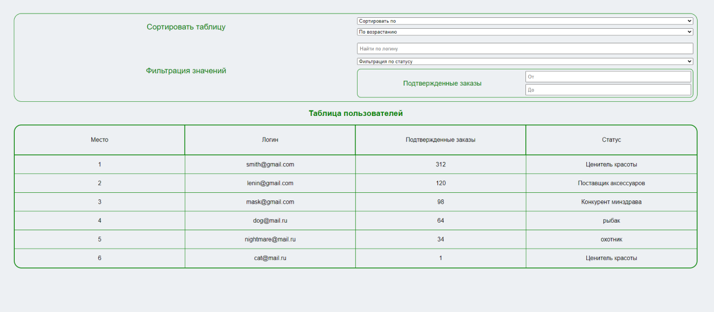

# <a id="top" />Тестовое задиние (Junior frontend developer)

## 

### Оглавление

- [Описание](#description)
- [Ссылки](#references)
- [Автор проекта](#author)

---

## <a id="description" />Описание

Тестовое задание

Необходимо реализовать отображение достижения пользователей в виде таблицы с фильтрами и сортировкой.

Инструменты разработки:
Vue, Vuex и Vue Router;
SCSS;
использовать доп. библиотеки нельзя.

Стиль таблицы и фильтров - на Ваше усмотрение. Но таблица должна одинаково и красиво отображаться в Chrome, Safari, FireFox. Использовать фильтры, сортировку и просматривать таблицу так же должно быть удобно и в моб. версии.
При применении фильтров и сортировки в таблице, должен формироваться url с соответствующими параметрами. При переходе по нему, фильтры и сортировка должны быть выставлены в соответствии с параметрами из url.

Результат тестового задания: должен быть размещен в виде репозитория на github или bitbucket.

### Функционал:

- Верстка интерфейса
- Фильтры:

  - по логину (регистронезависимая проверка на вхождение);
  - по количеству подтв. заказов “от” и “до”;
  - по статусу.

- Сортировка:
  - должна быть возможность сортировки по каждому полю в т.ч. обратная.

### Технологии

- Vue.js

[Наверх](#top)

---

## <a id="references" />Ссылки

### Посмотреть проект можно [&rarr; ЗДЕСЬ &larr;](https://andreikolosov.github.io/tl_group_test/)

[Наверх](#top)

---

## <a id="author" />Авторы

Андрей Колосов 2023г

- [Telegram ](https://t.me/RustyVoid)
- [Instagram](https://www.instagram.com/akolosof/)

[Наверх](#top)
